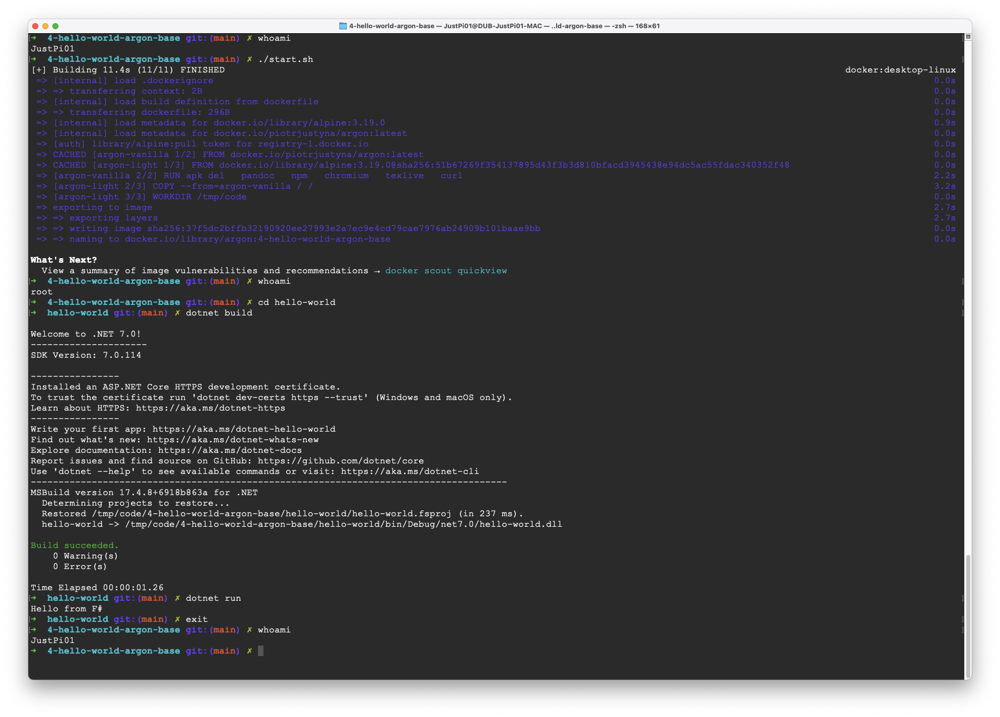
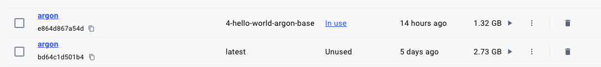

# 4-hello-world-argon-base

In this slightly more advanced example we explore using argon as a base image. Situations in which this could be useful are those where we want to tweak the operating system running in the container. We might want to do this to install or remove certain packages, alter the os configuration, etc.

In this example we are:

* removing some packages
* rebuilding the image on top of vanilla alpine in order to demonstrate size reduction

Vanilla argon image vs argon example 4 image:

## how to

* `./start.sh`
* `cd hello-world`
* `dotnet build`
* `dotnet run`
* `exit`